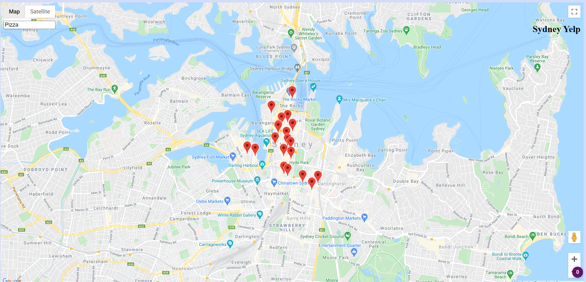

# fnd-project5

For quickstart

```bash
npm install
npm start
```

I refactored the knockout.js app to vue.js. It uses Yelp Api to give user recommendations on places in Sydney. By default it is looking for pizza. The pins are dropped to the map with 100ms setTimeouts in order to create the perception as if the data is streaming. You can check the picture Yelp api provides, and I also used google street view api to also get a picture of the location which is clickable.

Knockout branch is gh-pages.

You can see an image of the working app.



This year cors anywhere has changed their policy and only grant limited public access so you will need to request temporary access from this url to run the app locally 

https://cors-anywhere.herokuapp.com/


